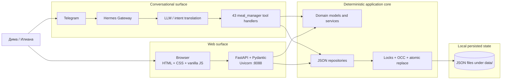
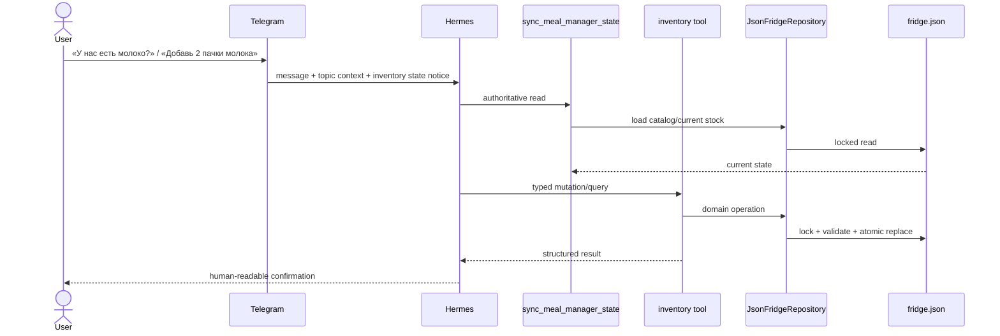
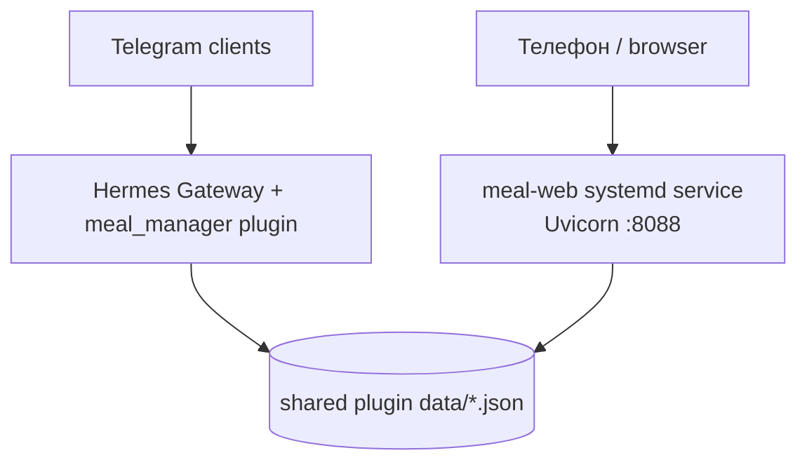

# Meal Planning: текущий System Design и Product Flow

> **Тип документа:** as-is overview — как система работает сейчас, а не целевая архитектура.
>
> **Проверенный snapshot:** ветка `main`, commit `20488b8` (`feat(inventory): add persistent product categories`).
>
> **Основной продуктовый принцип:** conversational shell + deterministic core. Пользователь говорит естественным языком, Hermes переводит намерение в типизированный tool call, а состояние изменяет обычный проверяемый Python-код.

---

## 1. Что это за продукт

Meal Planning — домашняя система для Димы и Илианы, которая объединяет:

- кухонный запас и каталог продуктов;
- рецепты;
- рекомендации «что приготовить»;
- историю готовки;
- заготовки (`PrepItem`);
- недельные планы;
- списки покупок и мягкие бюджетные ограничения;
- Telegram-интерфейс через Hermes;
- отдельный Web UI для просмотра и ограниченных ручных операций.

Система локальная и однодомохозяйственная. Сейчас в ней нет мультиаккаунтов, ролей, облачной БД или отдельного мобильного клиента.

---

## 2. Product surfaces

### 2.1 Telegram / Hermes — основной conversational flow

Пользователь пишет в Telegram обычным языком:

- «что у нас есть?»;
- «добавь молоко»;
- «что приготовить?»;
- «мы приготовили суп»;
- «составь план на неделю»;
- «что купить?».

Hermes:

1. понимает намерение;
2. при необходимости уточняет недостающие данные;
3. выбирает один или несколько `meal_manager` tools;
4. вызывает их с явными аргументами;
5. объясняет результат человеческим языком.

**Важно:** LLM интерпретирует запрос, но не должен самостоятельно вести продуктовый state. Запас, история, планы, scoring и lifecycle находятся в plugin-коде.

### 2.2 Web UI — inspect + limited manual operations

Web работает как отдельное FastAPI-приложение на порту `8088`. Интерфейс написан на vanilla HTML/CSS/JavaScript и обращается к backend через `fetch()`.

Текущие разделы:

1. **Обзор** — статистика и состояние системы;
2. **Рецепты** — просмотр и CRUD рецептов;
3. **Холодильник** — структурированный текущий запас;
4. **Каталог продуктов** — `in_stock`, `out_of_stock`, `recipe_only`, категории и replenishment;
5. **Рекомендации** — cookable dishes и scoring;
6. **Покупки** — быстрые one-ingredient unlock suggestions;
7. **Планы** — история и detail недельных планов, редактирование draft meals и удаление плана;
8. **История** — приготовленные блюда и undo/delete.

Продуктовая граница сейчас такая:

- Telegram/Hermes остаётся основным domain flow;
- Web удобен для просмотра и небольших явных исправлений;
- Web не заменяет conversational planning и не является вторым AI-агентом.

---

## 3. High-level architecture



### Ключевая идея

Система имеет **две поверхности**, но **одно persisted state**:

- агент вызывает plugin handlers;
- Web вызывает FastAPI routes;
- обе стороны читают и меняют JSON-файлы под `data/`.

Для inventory и weekly plans Web уже использует общие canonical models/repositories. Для recipes и history в Web ещё существуют локальные load/save helpers. Поэтому единый data store есть, но application layer пока переиспользуется не полностью.

---

## 4. Компоненты

### 4.1 Hermes Gateway

Gateway принимает Telegram-сообщение и создаёт контекст конкретного чата и topic.

Для topic **Meal Planning** (`thread_id=289`) включён exact-target inventory awareness hook. Он перед каждым LLM-вызовом добавляет только безопасные metadata:

- state token (`sha256`);
- количество текущих позиций;
- количество persisted identities;
- требование выполнить authoritative sync перед inventory-dependent ответом или действием.

Свободный текст из названий и комментариев не вставляется автоматически в system context: он считается данными, а не инструкциями.

### 4.2 LLM layer

Задача модели:

- понять естественный язык;
- выбрать tool;
- заполнить типизированные аргументы;
- связать несколько операций в последовательность;
- объяснить результат.

Модель **не является базой данных** и не должна считать старую переписку актуальным состоянием кухни.

### 4.3 Plugin registration layer

Entry point: `meal_manager/__init__.py:register(ctx)`.

При регистрации plugin:

1. настраивает repositories и DII storage;
2. регистрирует `pre_llm_call` awareness hook;
3. автоматически обнаруживает handler modules в `src/handlers/`;
4. регистрирует каждый handler как Hermes tool;
5. инжектит `skill.md` с conversational правилами использования tools.

Сейчас фактически присутствует **43 handler modules**.

### 4.4 Handler layer

Каждый tool — отдельный Python module с:

- `NAME`;
- `SCHEMA`;
- `HANDLER`.

Handlers отвечают за:

- проверку обязательных аргументов;
- нормализацию имён;
- перевод domain errors в стабильный JSON envelope;
- orchestration repository/domain операций.

### 4.5 Domain layer

Основные модели и сервисы:

| Область | Компоненты |
|---|---|
| Рецепты | `Dish`, essential/optional ingredients, `prep_depends` |
| Запас | `InventoryItem`, category, availability lifecycle |
| Каталог продуктов | проекция `in_stock` / `out_of_stock` / `recipe_only` |
| Рекомендации | availability + recency scoring |
| Обучение | bounded deterministic tuning state |
| Заготовки | `PrepItem`, ingredients, yield, remaining, storage |
| Недельный план | `WeekPlan`, `DayPlan`, `MealEntry` |
| Покупки | aggregation, price estimate, trip packing |
| DII | stateful ingredient-selection session |

### 4.6 Persistence layer

Persisted state находится в локальных JSON-файлах:

| Файл | Назначение |
|---|---|
| `data/fridge.json` | versioned inventory/catalog envelope, schema v4 |
| `data/dishes.json` | рецепты и ингредиенты |
| `data/history.json` | история приготовленных блюд |
| `data/tuning.json` | состояние adaptive suggestion weights |
| `data/prep_items.json` | определения и остатки заготовок |
| `data/plans/YYYY-WXX.json` | один недельный план на ISO week |
| `data/sessions/*.json` | crash-recovery snapshots DII-сессий |
| `data/awareness_targets.json` | allowlist Telegram topics для inventory awareness |

Это не «просто файлы без защиты»: inventory и plans используют repository abstraction, cross-process locks и atomic replacement.

---

## 5. Data ownership и consistency model

### 5.1 Inventory

`fridge.json` хранит не только текущий холодильник, а устойчивые product identities.

У позиции есть:

- stable `id`;
- normalized `name`;
- `quantity` и `unit`;
- `package_count`;
- `storage`;
- `expires_on`;
- `comment`;
- `category`;
- `available`;
- `ever_stocked`;
- timestamps.

Категории:

- `product` — обычный продукт;
- `prep` — заготовка/полуфабрикат как категория inventory;
- `ready_meal` — готовая еда.

`category=prep` не создаёт domain `PrepItem`: это две разные концепции.

Удаление или расход обычно не уничтожает identity, а переводит позицию в `available=false`. Replenishment возвращает identity в текущий запас и создаёт новую актуальную партию.

### 5.2 Web ↔ agent synchronization

Проблема: пользователь может изменить запас через Web, а затем продолжить старую Telegram-сессию.

Текущий механизм:

1. `pre_llm_call` вычисляет токен полного inventory state;
2. в Telegram topic приходит уведомление, что перед inventory-dependent операцией нужен sync;
3. Hermes вызывает `sync_meal_manager_state`;
4. tool возвращает authoritative snapshot и актуальный state token;
5. дальнейший ответ строится на свежем состоянии, а не на памяти чата.

Это turn-boundary pull synchronization. Mid-turn push из Web в уже идущий LLM-вызов сейчас отсутствует.

### 5.3 Inventory concurrency

Inventory mutations проходят через общий POSIX file lock и atomic file replacement.

Web edit/delete/category/replenish использует optimistic concurrency control:

- UI читает `updated_at`;
- mutation отправляет `expected_updated_at`;
- repository проверяет precondition внутри lock;
- при stale state Web получает HTTP `409 inventory_conflict` и authoritative current item;
- silent overwrite и silent retry запрещены.

Native agent tools используют тот же lock, но выражают последнее явное намерение пользователя без обязательного Web version token.

### 5.4 Weekly-plan concurrency

Web получает semantic SHA-256 version плана. Draft mutation отправляет `expected_version`.

Внутри plan lock backend:

1. заново читает план;
2. проверяет lifecycle и version;
3. применяет изменение;
4. сбрасывает derived shopping snapshot;
5. атомарно сохраняет новый план.

Stale request возвращает `409 plan_conflict` без автоматической перезаписи.

---

## 6. Основные product flows

### Flow A. Посмотреть или изменить кухонный запас через Telegram



### Flow B. Ручное изменение inventory через Web

1. Browser загружает `/api/inventory/items` или `/api/products`.
2. UI хранит stable `id` и `updated_at`.
3. Пользователь редактирует, удаляет, меняет category или replenishes позицию.
4. FastAPI/Pydantic валидирует payload.
5. Repository проверяет OCC precondition под file lock.
6. При успехе сохраняется новая версия и UI обновляет cache.
7. При конфликте возвращается `409`, UI должен показать актуальные данные вместо silent retry.

### Flow C. «Что приготовить?»

1. Hermes синхронизирует inventory.
2. `get_meal_suggestions` загружает recipes, current stock, history и tuning state.
3. Блюда без всех essential ingredients исключаются.
4. Блюда, приготовленные менее двух дней назад, исключаются.
5. Остальные ранжируются по availability и recency.
6. Optional ingredients повышают score, но не блокируют блюдо.
7. Hermes объясняет рекомендации и помогает выбрать.

Начальный blend — 60% availability / 40% recency. Он может медленно изменяться deterministic online learner-ом. Результат воспроизводим при одинаковых persisted state files.

### Flow D. «Мы приготовили блюдо»

1. `register_cooked_meal` проверяет рецепт.
2. Записывает сегодняшнюю дату в history.
3. Удаляет essential ingredients из current stock.
4. Уменьшает связанные `PrepItem.remaining`, если блюдо использует prep dependencies.
5. Обновляет tuning observation.
6. Следующие рекомендации учитывают cooldown и новый запас.

Undo history существует, но не является полной транзакционной перемоткой всех уже выполненных inventory side effects.

### Flow E. Добавить рецепт через DII

DII нужен, когда пользователь называет блюдо, но не даёт готовый ingredient list.

1. LLM строит ranked candidate list.
2. `init_ingredient_session` создаёт session и preselects верхние варианты.
3. Пользователь свободным текстом принимает, пропускает, удаляет или добавляет ингредиенты.
4. Plugin показывает по одному следующему suggestion.
5. Удаление essential ingredient возвращает `recalculation_needed=true`.
6. `finalize_ingredient_session` сохраняет dish и/или добавляет ingredients в inventory.
7. Session удаляется после commit; crash recovery хранится до TTL cleanup.

LLM предлагает кандидаты, но session transitions и выбранные списки хранятся deterministic tool layer-ом.

### Flow F. Prep-day

1. `add_prep_item` создаёт определение заготовки, но ничего не расходует.
2. `make_prep` проверяет essential source ingredients.
3. Источники списываются из inventory.
4. `remaining` устанавливается равным свежему configured yield.
5. При готовке зависимого блюда remaining уменьшается.

Новая партия заменяет remaining свежим yield, а не безусловно прибавляется к старому остатку.

### Flow G. Недельный план

1. `create_week_plan` создаёт `draft`.
2. Блюда добавляются в дни как references + portions.
3. Draft можно менять.
4. Lifecycle идёт только вперёд:

```text
draft → approved → active → archived
```

5. `repeat_week_plan` копирует структуру прошлого плана в новый draft и заново оценивает доступность.
6. Любое изменение meals инвалидирует старый derived shopping snapshot.

Web сейчас позволяет добавлять, заменять и удалять meals только в `draft`; non-draft content read-only. Удаление целого плана — отдельная подтверждаемая операция.

### Flow H. Shopping и budget

1. `generate_shopping_list` агрегирует essential ingredient uses из недельного плана.
2. Добавляет source ingredients для planned/depleted prep.
3. Вычитает текущую доступность по упрощённой use-based модели.
4. Сохраняет shopping snapshot внутрь week plan.
5. `estimate_plan_cost` применяет переданную карту цен.
6. Если часть цен неизвестна, budget status остаётся `unknown`, а не «в бюджете».
7. `split_shopping_list` раскладывает priced items по поездкам с мягким лимитом €100.
8. Мягкий недельный ориентир — €150; превышение предупреждает, но не блокирует.

Текущее ограничение: recipes ещё не задают количественные нормы ингредиентов. Поэтому расчёт использует cooking occurrences, а не граммы и реальные упаковки.

---

## 7. Web architecture

### Backend

- Python;
- FastAPI;
- Pydantic request models;
- Uvicorn;
- единый процесс `meal-web`;
- bind `0.0.0.0:8088`;
- static frontend раздаётся тем же приложением.

### Frontend

- один `static/index.html`;
- CSS и JavaScript встроены в файл;
- нет React/Vue/Svelte;
- нет npm/build pipeline;
- состояние страницы хранится в JS `CACHE`;
- API загружается через `Promise.allSettled` и `fetch()`;
- desktop sidebar + mobile drawer;
- часть UI preference хранится в `localStorage`.

### Сейчас отсутствует

- PWA manifest;
- service worker;
- offline cache;
- install flow;
- push notifications;
- Web authentication/authorization layer;
- ограниченный CORS allowlist — сейчас backend разрешает `*`;
- полноценный offline mutation queue и conflict reconciliation.

---

## 8. Deployment topology



Фактический Web service:

- service: `meal-web`;
- status на момент проверки: `active/running`;
- working directory: `meal_manager/web`;
- entry point: `web/main.py`;
- port: `8088`.

Gateway и Web — разные процессы. Поэтому корректность совместной записи обеспечивается не общей памятью процесса, а file locks, OCC и atomic replace.

---

## 9. Trust boundaries и безопасность

### Уже есть

- строгие tool schemas;
- Pydantic validation в Web API;
- нормализация имён;
- stable IDs;
- fail-closed parsing для критичных persisted structures;
- file locks;
- OCC для Web mutations;
- atomic replacement;
- exact-topic allowlist для inventory awareness;
- свободный текст inventory не инжектится как instructions;
- XSS-safe rendering как целевой UI contract;
- draft-only plan editing.

### Требует внимания

1. **Web не имеет собственной authentication layer.** Безопасность сейчас зависит от сетевого периметра.
2. **CORS открыт для `*`.** Для более широкого доступа это следует сузить.
3. **Обычный HTTP не даёт полноценный secure-context PWA flow.** Для service worker на телефоне нужен HTTPS.
4. **JSON — единый локальный store, но не полноценная transactional DB.** Multi-entity transactions и rich audit log ограничены.
5. **Web application logic частично дублирует plugin logic.** Inventory/plans уже ближе к canonical shared layer, recipes/history ещё требуют дальнейшей унификации.
6. **Agent state synchronization сейчас inventory-first.** Dishes/history и другие domains ещё не имеют такого же полного turn-boundary freshness contract.

---

## 10. Что реализовано, а что ещё planned

### Реализовано

- recipe catalog;
- structured inventory schema v4;
- persistent product catalog identities;
- product categories;
- replenishment;
- Web ↔ agent inventory freshness mechanism;
- meal suggestions;
- quick shopping unlocks;
- cooking history;
- adaptive deterministic tuning;
- DII;
- prep items;
- weekly plans и lifecycle;
- whole-week shopping snapshot;
- soft cost estimate и trip splitting;
- Web inventory/catalog CRUD;
- Web draft-plan meal editing и plan deletion routes;
- responsive Web shell.

### Planned / incomplete

- leftovers и household calibration;
- количественные recipe requirements;
- receipt-derived price database;
- автоматическое plan generation с plate-ratio checking;
- PWA/offline/installability;
- HTTPS и Web auth hardening;
- canonical shared application services для всех Web/plugin mutations;
- broader state synchronization beyond inventory.

---

## 11. Главные system-design компромиссы

| Решение | Плюс | Цена |
|---|---|---|
| JSON вместо БД | просто, прозрачно, легко backup/replay | сложнее multi-entity transactions, querying и audit |
| LLM только на boundary | естественный UX без потери детерминизма | orchestration зависит от качества intent parsing |
| Две поверхности, один store | Web и Telegram сразу видят общие данные | нужны locks, OCC и freshness contracts |
| Vanilla Web | нет build chain, легко запускать | один большой HTML/JS файл труднее развивать |
| Stable product identities | replenishment и history lifecycle не теряются | модель сложнее простого списка строк |
| Soft budget | система честно работает при неполных ценах | пока нет точной финансовой модели |
| Use-based shopping | работает без граммов в recipes | не знает реальный объём и упаковки |
| Pull sync перед LLM turn | защищает от stale inventory context | не решает mid-turn и все остальные domains |

---

## 12. Короткая product-flow формула

```text
Пользователь формулирует намерение
→ Hermes переводит его в typed operation
→ deterministic plugin валидирует и выполняет операцию
→ repository защищает persisted state
→ Web и Telegram читают один результат
→ Hermes объясняет новое состояние человеку
```

Главная ценность текущей архитектуры — не «AI сам планирует еду», а **разговорный интерфейс поверх объяснимой и проверяемой household state machine**.

---

## 13. Рекомендуемое следующее архитектурное направление

Если развивать систему постепенно, логичный порядок такой:

1. оформить Web как минимальную PWA shell без offline mutations;
2. включить HTTPS и ограничить сетевой доступ;
3. добавить manifest, icons, service worker и read-only offline cache;
4. вынести recipes/history Web logic в canonical shared repositories/application services;
5. расширить state-token/sync contract на dishes, history, plans и prep;
6. после этого проектировать offline writes, если они действительно нужны;
7. отдельно продолжить leftovers и quantity-aware recipes.

Такой порядок сохраняет текущую простоту и не создаёт преждевременно сложную distributed synchronization system.
